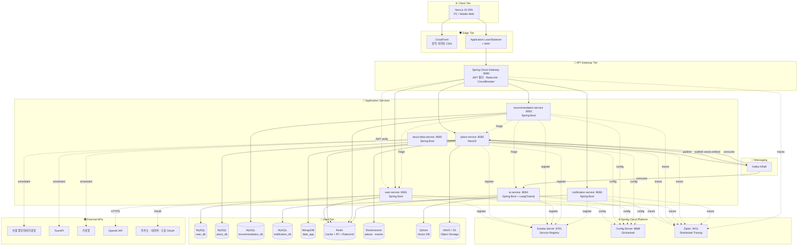
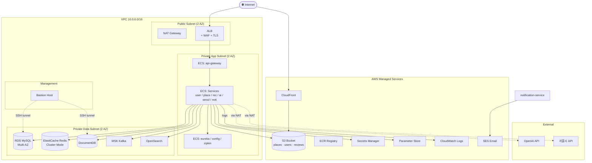
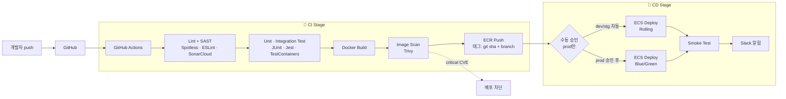
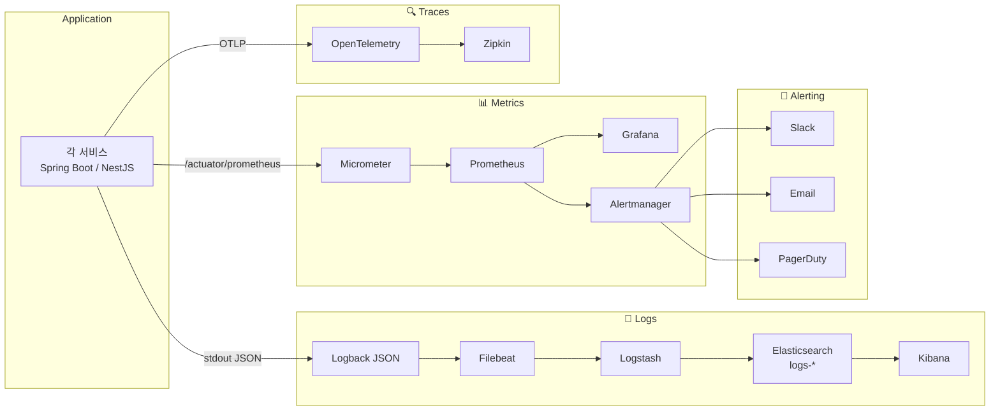
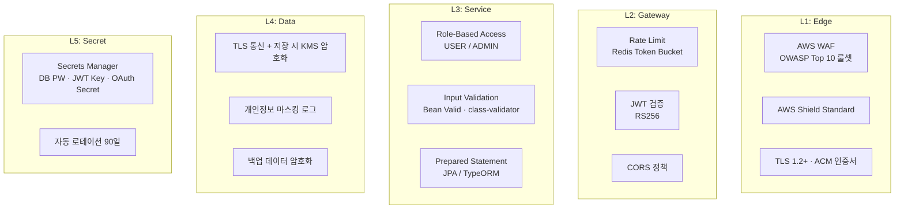
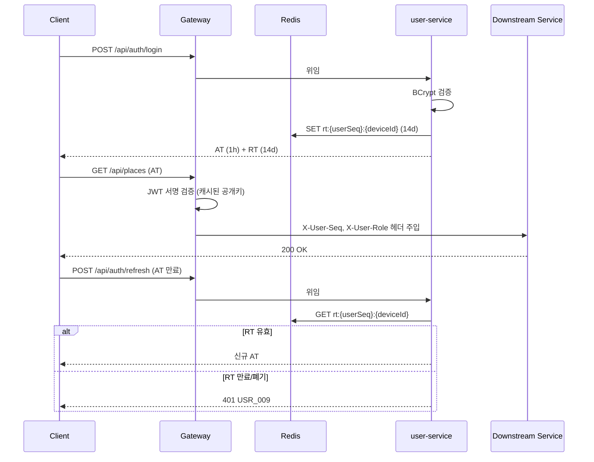
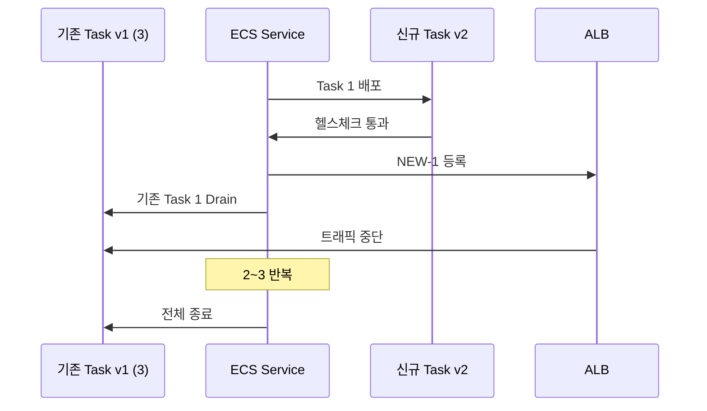
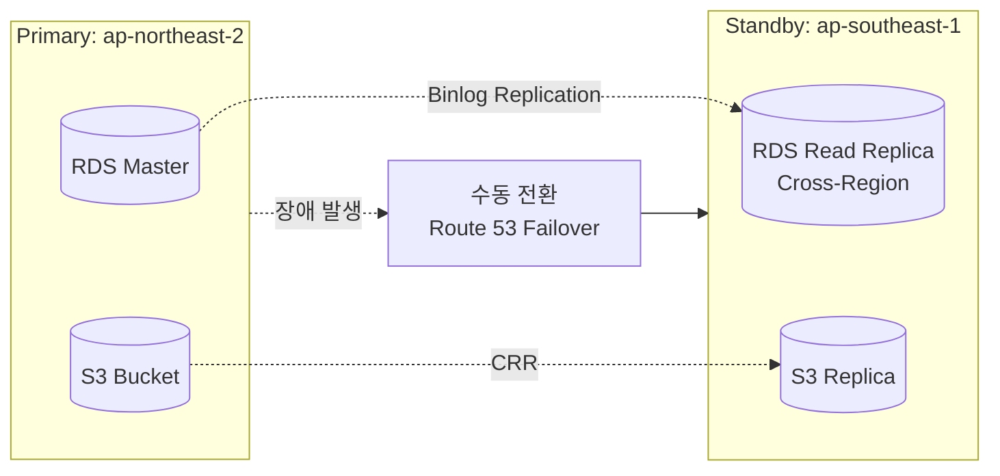
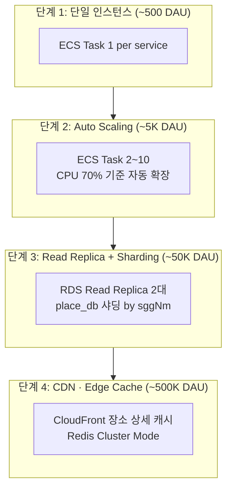

# Seoul Date App — 인프라 구성도

**문서 버전**: v1.0.0
**작성일**: 2026-04-16
**작성자**: 개발팀

> 본 문서는 `architecture.md` v1.0.0의 논리 아키텍처를 **시각화하고 운영 관점 인프라 레이어**(네트워크, CI/CD, 모니터링·로깅, 보안, 배포 전략, 재해복구)를 보완합니다.

---

## 목차

1. [전체 인프라 구성도](#1-전체-인프라-구성도)
2. [네트워크 토폴로지 (프로덕션)](#2-네트워크-토폴로지-프로덕션)
3. [로컬 개발 환경 (Docker Compose)](#3-로컬-개발-환경-docker-compose)
4. [CI/CD 파이프라인](#4-cicd-파이프라인)
5. [모니터링 · 로깅 스택](#5-모니터링--로깅-스택)
6. [보안 레이어](#6-보안-레이어)
7. [배포 전략](#7-배포-전략)
8. [재해복구 (DR) · 백업 전략](#8-재해복구-dr--백업-전략)
9. [확장 시나리오](#9-확장-시나리오)

---

## 1. 전체 인프라 구성도

### 1-1. 논리 아키텍처 (서비스 레이어)



### 1-2. 포트 · 네트워크 정리 (재확인)

| 레이어 | 서비스 | 포트 | 외부 노출 |
|---|---|---|---|
| Edge | Nginx / ALB | 80, 443 | O |
| Edge | CloudFront (CDN) | 443 | O |
| Gateway | api-gateway | 8080 | ALB 내부만 |
| Platform | eureka-server | 8761 | X (내부) |
| Platform | config-server | 8888 | X (내부) |
| Platform | zipkin | 9411 | 관리자만 |
| App | user-service | 8081 | X |
| App | place-service | 8082 | X |
| App | recommendation-service | 8083 | X |
| App | ai-service | 8084 | X |
| App | seoul-data-service | 8085 | X |
| App | notification-service | 8086 | X |
| Data | mysql-* | 3306~3309 | X |
| Data | redis | 6379 | X |
| Data | mongodb | 27017 | X |
| Data | elasticsearch | 9200 | 관리자만 |
| Data | qdrant | 6333 / 6334 | X |
| Data | minio | 9000 / 9001 | 콘솔만 관리자 |
| Msg | kafka | 9092 (내부) | X |
| Msg | kafka-ui | 8989 | 관리자만 |

---

## 2. 네트워크 토폴로지 (프로덕션)

### 2-1. AWS VPC 구성



### 2-2. 서브넷 · 보안그룹

| 서브넷 | CIDR | 배치 | 인바운드 |
|---|---|---|---|
| Public-A / B | 10.0.1.0/24, 10.0.2.0/24 | ALB, NAT Gateway | 80/443 from 0.0.0.0/0 |
| App-A / B | 10.0.11.0/24, 10.0.12.0/24 | ECS Fargate Tasks | from ALB SG만 |
| Data-A / B | 10.0.21.0/24, 10.0.22.0/24 | RDS, DocumentDB, ElastiCache, MSK, OpenSearch | from App SG만 |
| Mgmt | 10.0.31.0/24 | Bastion | SSH from 사내 IP |

**Security Group 규칙 예시**

| SG | 인바운드 포트 | 소스 |
|---|---|---|
| `sg-alb` | 80, 443 | 0.0.0.0/0 |
| `sg-gateway` | 8080 | sg-alb |
| `sg-app` | 8081~8086, 8761, 8888 | sg-gateway, sg-app (internal mesh) |
| `sg-rds` | 3306 | sg-app |
| `sg-redis` | 6379 | sg-app, sg-gateway |
| `sg-kafka` | 9092 | sg-app |
| `sg-bastion` | 22 | 회사 공인 IP만 |

---

## 3. 로컬 개발 환경 (Docker Compose)

### 3-1. Compose 파일 구조

```
seoul-date-app/
├── docker-compose.yml              # 기본 (인프라 + 플랫폼)
├── docker-compose.app.yml          # 어플리케이션 서비스 (프로파일)
├── docker-compose.monitoring.yml   # Prometheus · Grafana (선택)
├── .env
└── config-repo/                    # Config Server 로컬 마운트
```

### 3-2. 실행 프로파일

| 프로파일 | 포함 서비스 | 용도 |
|---|---|---|
| `infra` | MySQL, Redis, MongoDB, Elasticsearch, Kafka, MinIO, Qdrant | 로컬 인프라만 |
| `platform` | eureka, config, zipkin | 인프라 + Spring Cloud |
| `all` | 위 + 모든 앱 서비스 | 풀스택 |
| `monitoring` | Prometheus, Grafana, Alertmanager | 선택 확장 |

**실행 예시**
```bash
# 인프라 + 플랫폼만 띄우고 어플리케이션은 IDE에서 실행 (개발 생산성 ↑)
docker-compose --profile infra --profile platform up -d

# 모든 서비스 통합 기동 (인수 테스트)
docker-compose --profile all up -d

# 모니터링 스택 추가
docker-compose -f docker-compose.yml -f docker-compose.monitoring.yml up -d
```

### 3-3. 메모리 최적화 (로컬 제약 환경)

| 컨테이너 | 메모리 상한 | 튜닝 |
|---|---|---|
| mysql-* | 512M | `innodb_buffer_pool_size=128M`, `max_connections=50` |
| mongodb | 512M | `--wiredTigerCacheSizeGB 0.25` |
| elasticsearch | 1G | `ES_JAVA_OPTS=-Xms512m -Xmx512m` |
| kafka | 768M | `KAFKA_HEAP_OPTS=-Xmx512M -Xms512M`, 단일 브로커 KRaft |
| qdrant | 256M | default |
| redis | 128M | `maxmemory 128mb maxmemory-policy allkeys-lru` |
| 각 앱 서비스 | 512M | `JAVA_TOOL_OPTIONS=-Xmx384m -XX:MaxMetaspaceSize=128m` |

### 3-4. 네트워크 · 볼륨 구성

```yaml
networks:
  seoul-date-net:
    driver: bridge
    ipam:
      config:
        - subnet: 172.28.0.0/16

volumes:
  mysql-user-data:
  mysql-place-data:
  mysql-rec-data:
  redis-data:
  mongo-data:
  es-data:
  kafka-data:
  minio-data:
  qdrant-data:
```

---

## 4. CI/CD 파이프라인

### 4-1. 전체 흐름



### 4-2. 환경 분리

| 환경 | 브랜치 | 배포 방식 | 승인 | URL |
|---|---|---|---|---|
| `dev` | `develop` | 자동 | X | dev.seouldate.app |
| `stg` | `release/**` | 자동 | X | stg.seouldate.app |
| `prod` | `main` | 수동 승인 | Tech Lead | seouldate.app |

### 4-3. GitHub Actions 워크플로 (예시)

```yaml
# .github/workflows/user-service-ci.yml
name: user-service CI/CD

on:
  push:
    branches: [develop, main]
    paths: ['user-service/**']

jobs:
  test:
    runs-on: ubuntu-latest
    services:
      mysql: { image: mysql:8.0, ports: ['3306:3306'], env: { MYSQL_ROOT_PASSWORD: test } }
      redis: { image: redis:7.2, ports: ['6379:6379'] }
    steps:
      - uses: actions/checkout@v4
      - uses: actions/setup-java@v4
        with: { java-version: 21, distribution: 'temurin' }
      - name: Gradle test with coverage
        run: ./gradlew :user-service:test jacocoTestReport
      - uses: codecov/codecov-action@v4
      - name: SonarCloud
        run: ./gradlew sonar -Dsonar.token=${{ secrets.SONAR_TOKEN }}

  build-push:
    needs: test
    if: github.ref == 'refs/heads/main' || github.ref == 'refs/heads/develop'
    runs-on: ubuntu-latest
    steps:
      - uses: actions/checkout@v4
      - uses: docker/setup-buildx-action@v3
      - uses: aws-actions/configure-aws-credentials@v4
        with:
          role-to-assume: ${{ secrets.AWS_ROLE_ARN }}
          aws-region: ap-northeast-2
      - uses: aws-actions/amazon-ecr-login@v2
      - name: Build and push
        run: |
          IMAGE=${{ secrets.ECR_REGISTRY }}/user-service:${{ github.sha }}
          docker build -t $IMAGE user-service/
          docker push $IMAGE
      - name: Trivy scan
        uses: aquasecurity/trivy-action@master
        with:
          image-ref: ${{ secrets.ECR_REGISTRY }}/user-service:${{ github.sha }}
          severity: 'CRITICAL,HIGH'
          exit-code: '1'

  deploy-dev:
    needs: build-push
    if: github.ref == 'refs/heads/develop'
    runs-on: ubuntu-latest
    steps:
      - name: ECS Deploy
        run: |
          aws ecs update-service \
            --cluster seoul-date-dev \
            --service user-service \
            --force-new-deployment
```

### 4-4. 모노레포 vs 멀티레포

본 프로젝트는 **폴리레포 권장** (서비스별 CI 독립, 배포 속도 ↑). 공통 라이브러리(`common-lib`)만 별도 Git 저장소로 관리. 단, 설정은 `seoul-date-config-repo` 하나의 Git 저장소로 통합.

---

## 5. 모니터링 · 로깅 스택

### 5-1. 전체 관측성 스택



### 5-2. 메트릭 수집 설정

**Spring Boot (각 서비스 공통)**
```yaml
# application.yml
management:
  endpoints:
    web:
      exposure:
        include: health,info,prometheus,metrics
  metrics:
    tags:
      application: ${spring.application.name}
      environment: ${spring.profiles.active}
  prometheus:
    metrics:
      export:
        enabled: true
  tracing:
    sampling:
      probability: ${TRACING_SAMPLING_RATE:0.1}   # prod 10%, dev 100%
```

**Prometheus scrape 설정**
```yaml
# prometheus.yml
scrape_configs:
  - job_name: 'spring-services'
    metrics_path: '/actuator/prometheus'
    eureka_sd_configs:
      - server: http://eureka-server:8761/eureka
    relabel_configs:
      - source_labels: [__meta_eureka_app_instance_metadata_management_port]
        target_label: __address__
```

### 5-3. 핵심 모니터링 지표 (SLI)

| 카테고리 | 지표 | SLO 목표 | 알람 임계 |
|---|---|---|---|
| **가용성** | 서비스 5xx rate | <0.5% | 1% 5분간 지속 |
| **지연** | Gateway P95 응답시간 | <500ms | >1000ms 5분 |
| **지연** | ai-service 코스 생성 P95 | <10s | >15s 5분 |
| **처리량** | RPS (Gateway) | - | 급격한 증가 시 알람 |
| **에러** | Circuit Breaker OPEN | 0 | 발생 즉시 알람 |
| **자원** | JVM Heap 사용률 | <80% | 90% 10분 |
| **자원** | CPU 사용률 | <70% | 85% 10분 |
| **DB** | Connection pool 사용률 | <80% | 95% |
| **캐시** | Redis hit ratio | >60% | <40% |
| **LLM** | 시간당 호출 횟수 | - | 예산 초과 시 알람 |
| **LLM** | 토큰 일 소모량 | - | 예산 80% 시 경고 |

### 5-4. 로그 구조화 (JSON)

```json
{
  "@timestamp": "2026-04-16T14:00:00.123Z",
  "level": "INFO",
  "logger": "com.seouldate.user.UserController",
  "thread": "http-nio-8081-exec-1",
  "service": "user-service",
  "env": "prod",
  "traceId": "a3f9e8d7...",
  "spanId": "b7c6a5b4...",
  "userSeq": 1001,
  "message": "회원가입 완료",
  "http": { "method": "POST", "path": "/api/auth/signup", "status": 201, "durationMs": 245 }
}
```

**Logback 설정 (spring)**
```xml
<!-- logback-spring.xml -->
<configuration>
  <appender name="JSON" class="ch.qos.logback.core.ConsoleAppender">
    <encoder class="net.logstash.logback.encoder.LogstashEncoder">
      <customFields>{"service":"${spring.application.name}","env":"${SPRING_PROFILES_ACTIVE}"}</customFields>
      <maskingPatterns>
        <pattern>"password":"[^"]*"</pattern>
        <pattern>"refreshToken":"[^"]*"</pattern>
      </maskingPatterns>
    </encoder>
  </appender>
</configuration>
```

### 5-5. Grafana 대시보드 (서비스별)

- **Service Overview**: RPS, Error Rate, P50/P95/P99 Latency (RED 지표)
- **JVM**: Heap, GC, Threads
- **Database**: Connection Pool, Query Latency, Slow Queries
- **Redis**: Hit Ratio, Memory, Ops/sec
- **Kafka**: Consumer Lag, Partition 분포
- **LLM Cost**: 일별 토큰 소모량, 예상 비용 USD

---

## 6. 보안 레이어

### 6-1. 계층별 보안 구성



### 6-2. 인증 · 인가 흐름 (심화)



### 6-3. 보안 체크리스트

| 영역 | 체크 항목 | 구현 |
|---|---|---|
| 인증 | 비밀번호 BCrypt cost 12 | Spring Security |
| 인증 | JWT RS256, AT 1h / RT 14d | JWT 라이브러리 |
| 인증 | RT 로테이션 (갱신 시 기존 무효) | user-service |
| 인가 | Gateway 경로별 role 체크 | Gateway GlobalFilter |
| 통신 | HTTPS 전 구간 (Let's Encrypt / ACM) | ALB + Certbot |
| 입력 | SQL Injection 방지 | Prepared Statement |
| 입력 | XSS 방지 | React escape + Jsoup Sanitizer |
| 입력 | CSRF 방지 | SameSite Cookie / CORS 화이트리스트 |
| 저장 | 비밀번호 원문 저장 금지 | 해시만 |
| 저장 | 소셜 토큰 미저장 | user-service 정책 |
| 로그 | 민감정보 마스킹 | Logback MaskingPattern |
| 비밀 | 환경변수 아닌 Secrets Manager | AWS Secrets |
| 접근 | Bastion 통한 DB 접근만 | VPC + SG |
| 감사 | 관리자 API 감사 로그 | 전용 테이블 `tb_admin_audit` |

---

## 7. 배포 전략

### 7-1. 환경별 배포 방식

| 환경 | 전략 | 특징 |
|---|---|---|
| `dev` | Rolling Update | 자동 배포, 빠른 피드백 |
| `stg` | Rolling Update | 인수 테스트 |
| `prod` | Blue/Green | 순간 스위치, 즉시 롤백 가능 |

### 7-2. Rolling Update (ECS)



**파라미터**
- `minimumHealthyPercent: 100` (무중단 유지)
- `maximumPercent: 200` (일시적으로 2배 인스턴스 허용)

### 7-3. Blue/Green (Prod)

```
현재 프로덕션 = Blue (v1)
배포 시작
  → Green (v2) 생성 및 헬스체크
  → Green에 10% 트래픽 (Canary 단계)
  → 5분 관측 (에러율, P95 지연)
  → 문제 없으면 100% Green 전환
  → Blue 5분간 대기 (즉시 롤백 대비)
  → Blue 종료
```

**CodeDeploy 기반 설정**
```yaml
# appspec.yml
version: 0.0
Resources:
  - TargetService:
      Type: AWS::ECS::Service
      Properties:
        TaskDefinition: <TASK_DEF_ARN>
        LoadBalancerInfo:
          ContainerName: user-service
          ContainerPort: 8081
Hooks:
  - BeforeAllowTraffic: "LambdaFunctionToValidate"
  - AfterAllowTestTraffic: "SmokeTestLambda"
  - BeforeAllowTestTraffic: "LambdaFunctionToValidate"
```

### 7-4. 데이터베이스 마이그레이션

**Flyway 기반 (Spring 서비스)**

```
user-service/src/main/resources/db/migration/
├── V1__init_user_tables.sql
├── V2__add_user_interest.sql
├── V3__add_bookmark_table.sql
└── V4__add_social_acnt.sql
```

- 배포 시 `spring.flyway.enabled=true`로 자동 실행
- **호환성 원칙**: N-1 호환 (신버전이 구버전 스키마에서도 동작). 컬럼 삭제는 2단계(사용 중단 → 실제 삭제)
- `out_of_order=false` (순서 엄수)

**TypeORM Migration (place-service)**

```bash
npm run typeorm migration:generate -- src/migrations/AddPlaceReview
npm run typeorm migration:run
```

### 7-5. 롤백 전략

| 문제 유형 | 롤백 방법 |
|---|---|
| 앱 버그 | ECS 이전 Task Definition 재적용 (즉시) |
| DB 마이그레이션 실패 | Flyway `repair` 후 이전 리비전 배포 |
| 심각한 DB 손상 | RDS Point-in-Time Recovery (최대 5분 단위) |
| 설정 오류 | Config Server Git revert + 서비스 재기동 |

---

## 8. 재해복구 (DR) · 백업 전략

### 8-1. 백업 구성

| 자원 | 백업 방식 | 주기 | 보관 |
|---|---|---|---|
| RDS MySQL | 자동 스냅샷 + binlog | 일 1회 + 연속 | 30일 |
| DocumentDB | 자동 스냅샷 | 일 1회 | 30일 |
| ElastiCache | RDB 스냅샷 | 일 1회 | 7일 (캐시) |
| OpenSearch | 수동 스냅샷 → S3 | 주 1회 | 30일 |
| Qdrant | Snapshot API → S3 | 일 1회 | 14일 |
| MinIO / S3 | Versioning + Cross-Region Replication | 실시간 | 90일 Glacier |
| Config Repo | Git 자체 | 실시간 | 무제한 |

### 8-2. RTO · RPO 목표

| 장애 유형 | RTO | RPO |
|---|---|---|
| 단일 Task 장애 | <1분 (ECS 자동 복구) | 0 |
| AZ 장애 | <15분 (Multi-AZ RDS failover) | <1분 |
| Region 장애 | <2시간 (수동 DR 전환) | <15분 |
| 데이터 손상 (악의적 삭제 등) | <4시간 | <24시간 (일 백업 기준) |

### 8-3. DR 시나리오: Region 장애 대응



- Route 53 Health Check로 Primary 장애 감지 → 수동 승인 후 Standby로 DNS 전환
- Read Replica를 Standalone으로 승격(promote)
- DR 훈련은 분기 1회 수행

---

## 9. 확장 시나리오

### 9-1. 트래픽 증가 대응



### 9-2. Auto Scaling 정책

| 서비스 | 최소 | 최대 | 스케일 아웃 트리거 | 스케일 인 |
|---|---|---|---|---|
| api-gateway | 2 | 10 | CPU >70% 2분 | CPU <30% 10분 |
| user-service | 2 | 6 | CPU >70% 2분 | CPU <30% 10분 |
| place-service | 2 | 10 | 요청 RPS >100/task | - |
| recommendation-service | 2 | 6 | 요청 RPS >30/task | - |
| ai-service | 1 | 4 | 요청 RPS >10/task | LLM 비용 상한 고려 |

### 9-3. LLM 비용 관리

**월별 상한 예산** → 초과 시 알람 + 기본 추천 fallback 전환
- 일 호출 수 모니터링
- 캐시 히트율 상승으로 비용 절감 (60% 이상 유지)
- 고비용 사용자(상위 5%) 개별 제한 적용 가능

---

## 10. 개정 이력

| 버전 | 일자 | 변경 내용 |
|---|---|---|
| v1.0.0 | 2026-04-16 | 최초 작성. architecture.md 보완 목적으로 시각화·네트워크·CI/CD·모니터링·보안·배포·DR 통합 |
